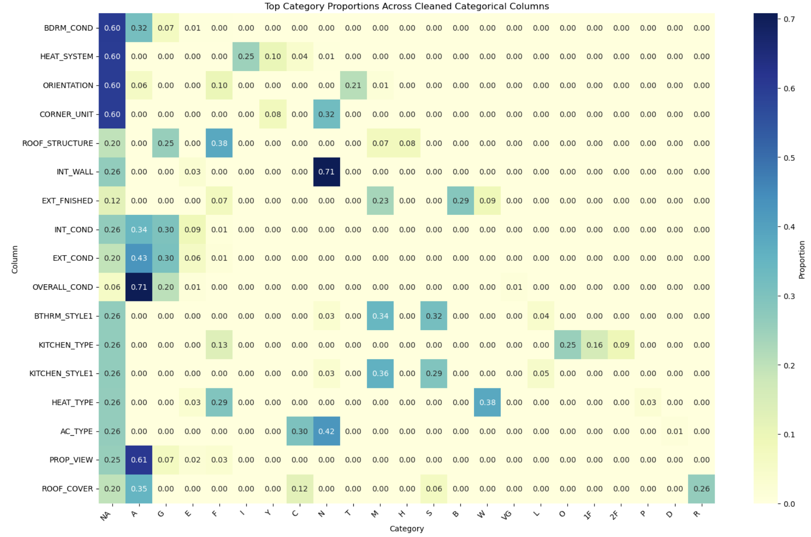
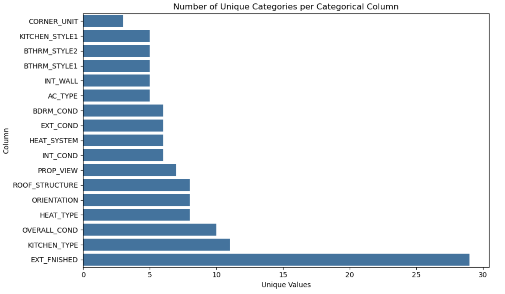
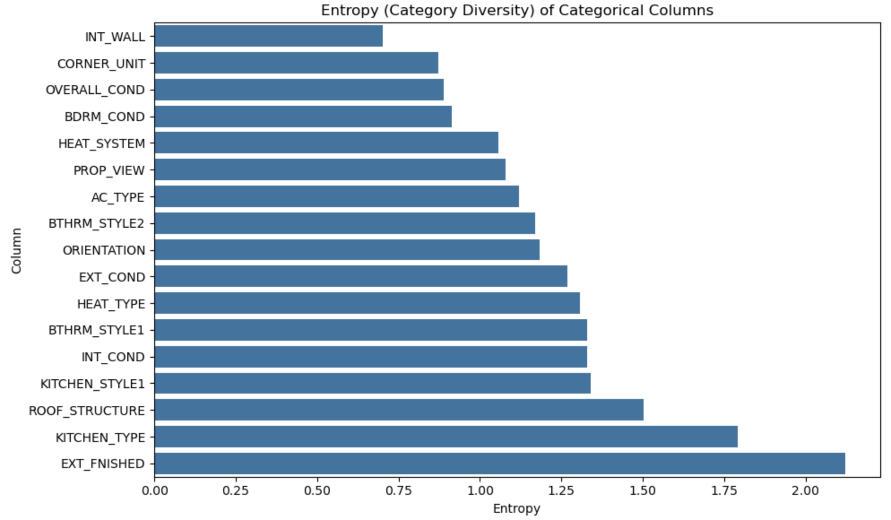
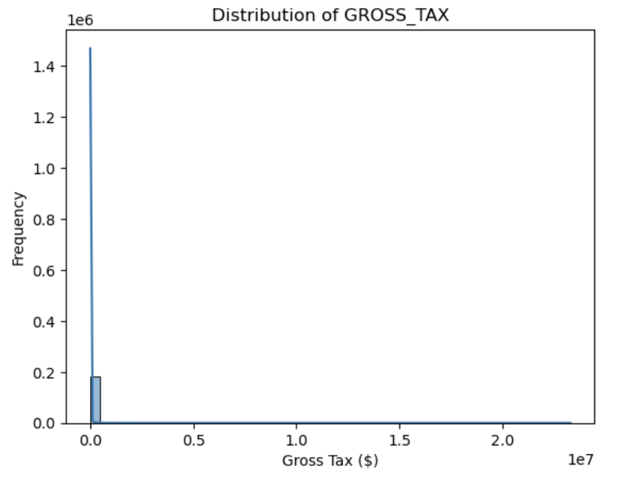
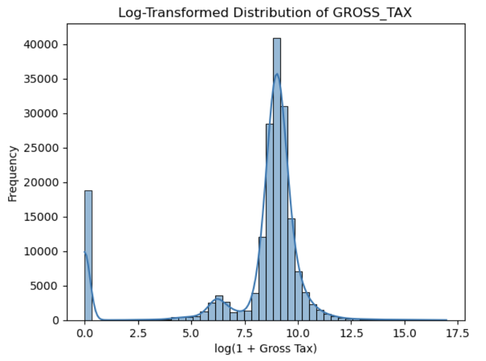
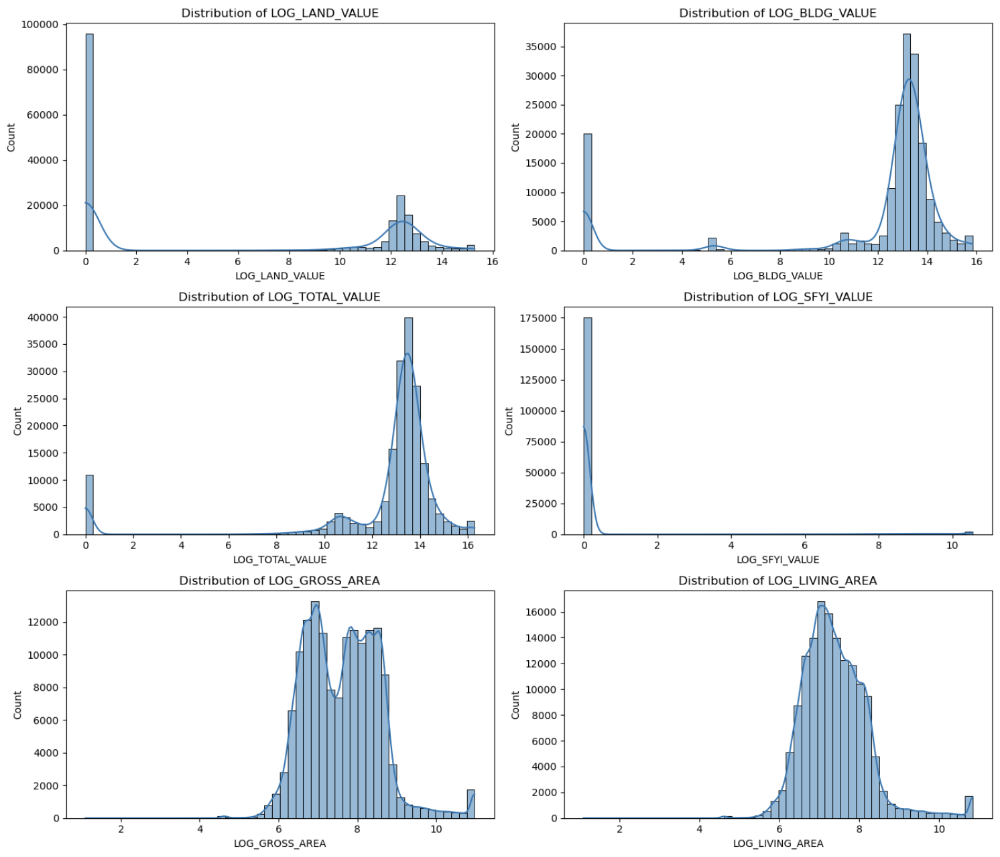
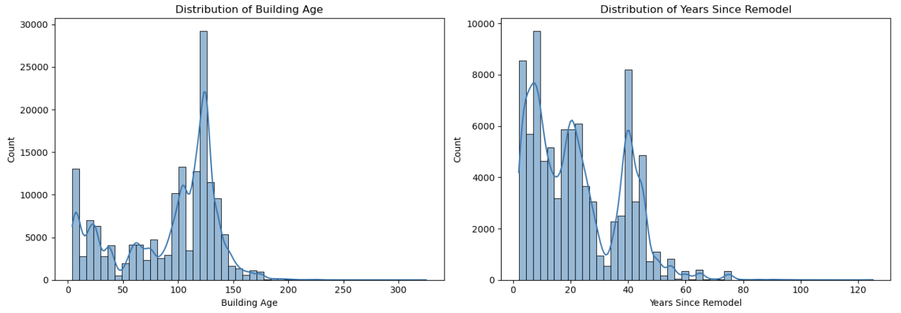
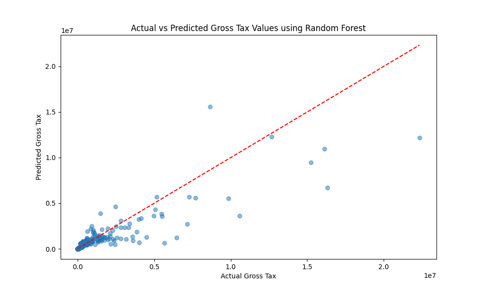

# Data-Science-Project

## Mid-Term Presentation
https://youtu.be/n2QhbOy2V7o 

## Boston Housing Violations Analysis
### Description
The project's aim is to analyze different violations around the city of Boston and identify systemic issues and trends.
Using violation records from the given datasets, we aim to provide actionable insights to improve housing quality.

### Dataset(s)

- [Public Works Violations Dataset](https://data.boston.gov/dataset/public-works-violations)
- [Building and Property Violations Dataset](https://data.boston.gov/dataset/building-and-property-violations1)
- [Property Assessment Dataset](https://data.boston.gov/dataset/property-assessment)
- [Live Street Address Management Dataset](https://data.boston.gov/dataset/live-street-address-management-sam-addresses)

### Project Blueprint: Making Sense of the Notebooks

* The 'Public Works Violations' dataset can be cleaned using PWV_Cleaning.ipynb notebook. This will generate a processed file named PWV_processed.csv.

* The generated PWV_processed.csv file should be loaded to TDS_Midterm_Clustering_EDA_6.ipynb to replicate our analysis and find answers to key questions discussed in "Insights" section. 

* The location plots can be created for visualization by running DS_Midterm_Clustering_EDA_6.ipynb and boston_violations_map.ipynb files with the same processed data.

* Download the 'Building and Property Violations' dataset and run it through the Property_Violations.ipynb notebook to obtain a preprocessed dataset and draw insights of data distribution.

* Our baseline model results can be reproduced using the init_pred_modelling.ipynb file.

### Data preprocessing
We performed data cleaning and preprocessing for three different datasets corresponding to different analytical objectives.

1. Building and Property Violations

    * We began by checking for null values in the dataset. The columns 'value', 'violation_sthigh', and 'contact_addr2' were dropped as they contained over 70% missing values.

    * Next, we then imputed the null values in 'Description' column with 'Unknwown' value. This column provides valuable information about the type of violation, so we opted to retain it rather than drop the Null records. This allowed us to retain around 50% of the rows with atleast one null value.

    * We dropped the remaining rows with missing values, around 300 out of 16591 entries. 

    * Duplicate rows (16 in total) were also identified and removed.
    
    * Additionally, we dropped the 'status_dttm' column, which contained timestamp information that was not relevant for our current analysis, and the 'location' column due to information redundancy.
    
    * Finally, we applied binary encoding to the 'status' column for further processing.

2. Public Works Violations Dataset
    * The preprocessing steps for this dataset were mostly similar to those applied to the Building and Property Violations dataset, as both share a similar structure but contain different values.

    * We began by dropping several attributes, namely 'violation_sthigh', 'contact_addr2', 'violation_state', 'contact_zip', 'contact_state', 'contact_city', 'violation_suffix' and 'ticket_no'. Some of these had a significant number of missing values, while others were deemed redundant at this stage.

    * The 'description' and 'code' columns contained subcategories, so we consolidated into broader categories to simplify the dataset.

            Before:
            10a -> ['Illegal dumping park']
        
            10b -> ['Illegal dumping 1-5 cuyd.']
        
            10c -> ['Illegal dumping 5 cubic yd.']

            After:
            10 -> ['Illegal dumping']
    
3. Public Assessment Dataset

    * For this dataset, our current goal was to explore whether building characteristics could be used to train a classifier to predict the likelihood of a violation.

    * To enable this, we merged the Public Works Violations dataset with the Property Assessment dataset. The linkage was established through the Street Address Management dataset. 
    
    * The attribute 'sam_id' from the Public Works dataset corresponds to 'SAM_ADDRESS_ID' in the Street Address Management dataset. The attribute 'PARCEL' from the Street Address Management dataset corresponds to 'PID' in the Property Assessment dataset. Based on this connection we added new attribute to Property Assessment Dataset, 'violation_bool' has value 1 if the corresponding 'PID' has a violation recorded, else 0.

    * As part of standard data cleaning process, we dropped attributes with a considerable amount of null values. We also removed location-based attributes which were not useful for current analysis objectives.

    * Finally, we imputed missing values for key attributes such as 'FULL_BTH', 'HLF_BTH', 'KITCHENS', and 'FIREPLACES', which we considered potentially important for predicting violations. Any remaining rows with null values were then removed.

4. Part2 - Public Assessment Dataset (Independent Exploration)

    In this phase, we analyzed the Property Assessment dataset independently (i.e., not in relation to violations) to explore its internal structure, completeness, and categorical distributions for modeling and insight generation.

    * Dropped Columns with more than 80% Missing Values: We removed highly sparse attributes such as 'ST_NUM2', 'MAIL_ADDRESSEE', 'RES_UNITS', 'COM_UNITS', 'RC_UNITS', 'STRUCTURE_CLASS', 'KITCHEN_STYLE2', 'KITCHEN_STYLE3', and 'BTHRM_STYLE3'. 
    
    * After analysis, I found that the following columns, 'BTHRM_STYLE2', 'CD_FLOOR', 'CM_ID', and 'UNIT_NUM' were also not adding value so removed them as well. The column analysis below helped me determine its usefulness.
    
        `BTHRM_STYLE1` (rows) vs `BTHRM_STYLE2` (columns)

| BTHRM_STYLE1 \\ BTHRM_STYLE2 | L - Luxury | M - Modern | N - No Remodeling | S - Semi-Modern | NaN    |
|------------------------------|------------|------------|-------------------|------------------|--------|
| **L - Luxury**               | 4127       | 2663       | 3                 | 29               | 1198   |
| **M - Modern**               | 91         | 37203      | 288               | 4305             | 21251  |
| **N - No Remodeling**        | 0          | 185        | 2843              | 783              | 1930   |
| **S - Semi-Modern**          | 12         | 2745       | 866               | 31031            | 23450  |
| **NaN**                      | 0          | 0          | 1                 | 0                | 48441  |

    
    
* We parsed compound categorical fields like 'ROOF_COVER', 'KITCHEN_TYPE', 'INT_COND', 'HEAT_TYPE', etc. using string splits to separate codes from labels, and handled missing values by filling with 'NA' as the value.
    
            Before:
            Col Name - PROP_VIEW
            A - Average      111884
            NaN               46679
            G - Good          13086
            F - Fair           6071
            E - Excellent      4536
            S - Special         667
            P - Poor            522
            Name: count, dtype: int64

            After:
            PROP_VIEW
            A     111881
            NA     46677
            G      13086
            F       6071
            E       4536
            S        667
            P        522
            Name: count, dtype: int64
            

    
* Also, visualized the uniqueness of categorical columns and calculated their respective entropy to identify features that are most informative.

    

* The 'GROSS_TAX' column contained inconsistent string formats (like "$-"), which prevented numerical analysis. We standardized it by stripping whitespace, removing currency symbols and commas, and cast the cleaned strings to float for quantitative use.
    
* Several numeric columns such as 'LAND_SF', 'LAND_VALUE', 'BLDG_VALUE', 'TOTAL_VALUE', and 'SFYI_VALUE' were originally stored as strings with embedded commas (e.g., "1,200"). We removed the commas and converted these columns to float to enable proper numerical computation and statistical analysis.
    
* The 'GROSS_TAX' column, which we intend to use as our target variable, exhibited extreme right skewness due to a large number of low-tax entries and a few outliers with very high tax values (as seen in the original distribution). To address this, we applied a log(1 + x) transformation, which effectively compressed the range and normalized the distribution. This transformation is crucial for improving model performance and stability by reducing the influence of outliers and enabling better learning from mid-range tax values.
    

* Similarly, applied log transformation on other important numerical columns.
    

* Finally, To capture temporal features relevant to property condition and valuation, we engineered two new columns: 'BUILDING_AGE' (calculated as current_year(2025) - 'YR_BUILT') and 'YEARS_SINCE_REMODEL' (calculated as current_year - 'YR_REMODEL'). The distribution of 'BUILDING_AGE' revealed a wide range, with distinct construction waves over time, while 'YEARS_SINCE_REMODEL' was right-skewed, indicating that most remodels occurred relatively recently. These engineered features provide valuable insight for both descriptive analysis and predictive modeling.
    

### Current Insights

1. We were able to answer a few key questions regarding the Public Works Violations dataset:
    
    * Q: Which address has the most repeated violations? A: 74 Clarendon ST Suite A
    
        

    * Q: Which zipcode has the most violations? A: 02127
    
            

    * Q: Which is the most common violation? A: Improper trash disposal

        

2. As part of our analysis, we explored clustering the violation descriptions from the Public Works Violations dataset into broader categories as a step towards downstream multiclass classification. Although the results were not definitive, hierarchical clustering applied to the t-SNE components of the description embeddings produced the most promising grouping results.

3. The preliminary analysis on the Building and Property Violations dataset revealed that the majority of violations were related to "mechanical execution of work".

    Additionally, Dorchester emerged as the neighborhood with the highest number of recorded violations.

4. Heatmaps of building violations offer valuable visual insights into spatial distribution patterns, helping identify hotspots where violations are most concentrated. By grouping violation data by geographic coordinates and applying a weighted color gradient, we can quickly pinpoint areas that may require urgent attention.

    * In our analysis, we began by preprocessing the data to ensure the accuracy of latitude and longitude values. We then aggregated the records by location and computed the number of violations at each point. 
    * Using the Folium library, we overlaid a heatmap on a base map of Boston to visualize violation density across the city.
    * This approach revealed both citywide trends and specific high-risk areas. Notably, neighborhoods such as Dorchester and Roxbury emerged as significant hotspots, indicating potential long-term compliance issues in these locations. These insights can inform targeted enforcement efforts and guide the more efficient allocation of resources for improving building safety.

5. We attempted to visualize violations by mapping them to their geographic locations to identify whether certain areas had a higher concentration of specific types of violations.

    The spatial distribution appeared uniform as violations of all types seemed to occur across all regions. When all violation types were plotted together, trash-related violations overwhelmingly dominated the map due to their high frequency. When plotted separately by category, the violations either appeared too sparse to identify patterns or too dense to differentiate meaningfully.

### Preliminary results
#### 1. Binary Violation Prediction

We used features from the Boston Public Assessment Dataset to predict whether a property is likely to incur a public works violation.
 * Hypothesis: 
 Certain features might correlate with violations:
- **Building type**: Apartments may be more prone to violations.
- **Owner occupancy**: Properties where the owner doesn't reside may be less well-maintained.

We framed this as a **binary classification** problem.

1. Logistic Regression: 

    **With class weighting (no sampling):**

    * Confusion Matrix:
        
        |                  | Predicted: No Violation | Predicted: Violation |
        |------------------|-------------------------|-----------------------|
        | **Actual: No Violation** | 27,506                  | 3,102                 |
        | **Actual: Violation**     | 405                     | 5,676                 |

    * Classification Report:

        | Class                 | Precision | Recall | F1-Score | Support |
        |-----------------------|-----------|--------|----------|---------|
        | **0 (No Violation)**  | 0.99      | 0.90   | 0.94     | 30,608  |
        | **1 (Violation)**     | 0.65      | 0.93   | 0.76     | 6,081   |
        | **Accuracy**          |           |        | **0.90** | 36,689  |
        | **Macro Avg**         | 0.82      | 0.92   | 0.85     | 36,689  |
        | **Weighted Avg**      | 0.93      | 0.90   | 0.91     | 36,689  |

    * Accuracy Score: 0.9044127667693314

        **Insight:** High recall for violations (0.93) with reasonable precision (0.65). This was the best-balanced model.

    **With undersampling:**

    * Confusion Matrix:
        
        |                  | Predicted: No Violation | Predicted: Violation |
        |------------------|-------------------------|-----------------------|
        | **Actual: No Violation** | 23,882                  | 6,726                |
        | **Actual: Violation**     | 2,735                     | 3,346                |

    * Classification Report:

        | Class                 | Precision | Recall | F1-Score | Support |
        |-----------------------|-----------|--------|----------|---------|
        | **0 (No Violation)**  | 0.90      | 0.78   | 0.83     | 30,608  |
        | **1 (Violation)**     | 0.33      | 0.55   | 0.41     | 6,081   |
        | **Accuracy**          |           |        | **0.74** | 36,689  |
        | **Macro Avg**         | 0.61      | 0.67   | 0.62     | 36,689  |
        | **Weighted Avg**      | 0.80      | 0.74   | 0.76     | 36,689  |

    * Accuracy Score: 0.7421297936711276

        **Insight:** Improved class balance, but precision for violations dropped significantly

2. RandomForest Classifier: 

    **With class weighting (no sampling):**

    * Confusion Matrix:
        
        |                  | Predicted: No Violation | Predicted: Violation |
        |------------------|-------------------------|-----------------------|
        | **Actual: No Violation** | 29,749                  | 859              |
        | **Actual: Violation**     | 3,243                     | 2,838                 |

    * Classification Report:

        | Class                 | Precision | Recall | F1-Score | Support |
        |-----------------------|-----------|--------|----------|---------|
        | **0 (No Violation)**  | 0.90      | 0.97   | 0.94     | 30,608  |
        | **1 (Violation)**     | 0.77      | 0.47   | 0.58     | 6,081   |
        | **Accuracy**          |           |        | **0.89** | 36,689  |
        | **Macro Avg**         | 0.83      | 0.72   | 0.76     | 36,689  |
        | **Weighted Avg**      | 0.88      | 0.89   | 0.88     | 36,689  |

    * Accuracy Score: 0.8881953719098368

        **Insight:** Prioritized precision for violations (0.77), but missed many actual violations (recall 0.47).

    **With undersampling:**

    * Confusion Matrix:
        
        |                  | Predicted: No Violation | Predicted: Violation |
        |------------------|-------------------------|-----------------------|
        | **Actual: No Violation** | 22,208                  | 8,400                 |
        | **Actual: Violation**     | 310                     | 5,771                 |
  

    * Classification Report:

        | Class                 | Precision | Recall | F1-Score | Support |
        |-----------------------|-----------|--------|----------|---------|
        | **0 (No Violation)**  | 0.99      | 0.73   | 0.84     | 30,608  |
        | **1 (Violation)**     | 0.41      | 0.95   | 0.57     | 6,081   |
        | **Accuracy**          |           |        | **0.76** | 36,689  |
        | **Macro Avg**         | 0.70      | 0.84   | 0.70     | 36,689  |
        | **Weighted Avg**      | 0.89      | 0.76   | 0.79     | 36,689  |

    * Accuracy Score: 0.7625991441576494

        **Insight:** Extremely high recall (0.95) but over-flagged clean properties, reducing precision (0.41).

####  Summary Table

| Model                          | Accuracy | Recall (Class 1) | Precision (Class 1) | F1 (Class 1) |
|--------------------------------|----------|------------------|---------------------|--------------|
| Logistic Regression (balanced) | 0.904    | **0.93**         | 0.65                | **0.76**     |
| Random Forest (balanced)       | 0.888    | 0.47             | **0.77**            | 0.58         |
| Random Forest + Undersampling  | 0.763    | **0.95**         | 0.41                | 0.57         |
| Logistic Regression + Undersampling | 0.742 | 0.55             | 0.33                | 0.41         |

---

#### Final Takeaway

Class-weighted **Logistic Regression with scaling** provided the best overall balance for detecting violations, combining high recall and interpretability.  

Undersampling helped when recall was mission-critical but significantly harmed precision.

#### 2. Anomaly detection based on time and location

Using the processed Public Works Violations dataset, we tried to model a anomaly detection model using KMeans.
We grouped the violations based on ZIP code, month and used KMeans clustering to model what a "typical" month looks like in each ZIP. ZIP-months with violation patterns far from their cluster centroids were considered anomalous.

        A thing to keep in mind, we excluded the trash violations, because they comprised more than half of the dataset skewing our results. 
        
(Boston has a trash problem [1](https://www.nbcboston.com/news/local/can-steeper-fines-fix-bostons-rat-problem/3591339/) [2](https://www.boston.com/news/local-news/2022/10/26/uncovered-trash-has-made-for-easy-feasting-for-rodents-now-boston-officials-are-looking-to-end-the-rat-buffet/))

 **Features used:**
- ZIP code
- Violation description (one-hot encoded)
- Year and month (aggregated)
- Trash-related violations were excluded to reduce skew

**Top Anomalous ZIP-Months:**

        | ZIP     | Year-Month | Anomaly Score |
        |---------|------------|----------------|
        | 2124.0  | 2010-07    | 55.5           |
        | 2131.0  | 2009-10    | 51.5           |
        | 2126.0  | 2017-05    | 47.5           |
        | 2127.0  | 2021-02    | 38.7           |
        | 2135.0  | 2021-02    | 38.3           |

**Real-World Correlations:**

- **July 2010 (ZIP 2124)**: Protest against immigration laws in Boston [article](https://www.wbur.org/news/2010/07/11/immigration-protest)
- **Oct 2009 (ZIP 2131)**: Early Nor’easter snowstorm [article](https://www.wbur.org/news/2009/10/19/october-snow)
- **May 2017 (ZIP 2126)**: Boston Calling festival & cultural events [article](https://www.msgentertainment.com/boston-calling-music-festival-announces-its-2017-lineup-headlined-by-tool-mumford-sons-and-chance-the-rapper/)  

These events may explain sharp deviations in violation behavior from the usual patterns.

#### 3. Property Tax Prediction

Using the cleaned Property Assessment dataset, we developed regression models to predict property gross tax values. The analysis focused on using both standard property features and their logarithmic transformations to achieve more accurate predictions.

##### Data Preparation
- We identified several missing values in key columns and addressed them using median imputation
- The dataset had 21 categorical features that were one-hot encoded for modeling
- Log transformations were applied to numerical values (GROSS_AREA, LIVING_AREA, LAND_VALUE, BLDG_VALUE, TOTAL_VALUE, SFYI_VALUE, GROSS_TAX) to normalize distributions and improve model performance
- We engineered temporal features including BUILDING_AGE and YEARS_SINCE_REMODEL to capture property condition information

##### Model Performance
We evaluated several regression models:

| Model | MSE | RMSE | MAE | R² |
|-------|-----|------|-----|---|
| Linear Regression | 0.0870 | 0.2949 | 0.1294 | 0.9899 |
| Ridge Regression | 0.0869 | 0.2949 | 0.1294 | 0.9899 |
| Lasso Regression | 2.3497 | 1.5329 | 1.0427 | 0.7264 |
| Random Forest | 0.0018 | 0.0426 | 0.0036 | 0.9998 |
| Gradient Boosting | 0.0047 | 0.0686 | 0.0271 | 0.9995 |

The **Random Forest** model significantly outperformed all other models, achieving an R² score of 0.9998, indicating it explained nearly all the variance in the target variable (log-transformed gross tax).

##### Feature Importance
Analysis of the Random Forest model revealed the top predictive features:

1. **LUC** (Land Use Code): By far the most important feature (importance: 0.86), indicating that property classification is the primary determinant of tax rates
2. **LOG_TOTAL_VALUE**: The log-transformed total value of the property (importance: 0.07)
3. **TOTAL_VALUE**: The raw total value of the property (importance: 0.07)

Other features including land square footage, building type, and property age had much smaller contributions to the predictions.

##### Visualization
The scatter plot below shows the relationship between actual and predicted gross tax values using the Random Forest model:

The model demonstrates excellent prediction capability across different tax ranges, with predictions closely following the ideal line (red dashed line), particularly in the lower tax ranges. The model performs slightly less accurately for very high-value properties, which is expected given their relative scarcity in the dataset.

##### Conclusion
The high predictive accuracy of the model suggests that property taxes in Boston follow a consistent, systematic pattern based primarily on the property's land use code and total value. The model could be useful for:

- Property owners to estimate future tax obligations
- City planners to understand tax revenue patterns
- Policymakers to assess the impact of potential changes to tax structures

The logarithmic transformation of the target variable proved essential for achieving high model performance, indicating that tax values follow a multiplicative rather than additive relationship with underlying property features.

### Next Steps

1. We have tried to answer most of the base questions from the original project's document. But our insights feel a little incohesive at the moment. We need to try to get solid trends from the data.

2. Using the 'status_dttm', we should be able to get time data for the violations, using which we could get better insights like recurrence of violation, a specific rise in violations etc.

3. See if we can find any other target variables that we can predict from the data available.

4. We are currently hindered by our lack of domain knowledge to impute a lot a null values. We need to find better ways.

5. We need to do a better clean up of data's location attributes using Street Address Management dataset.

6. A better organization of code.
